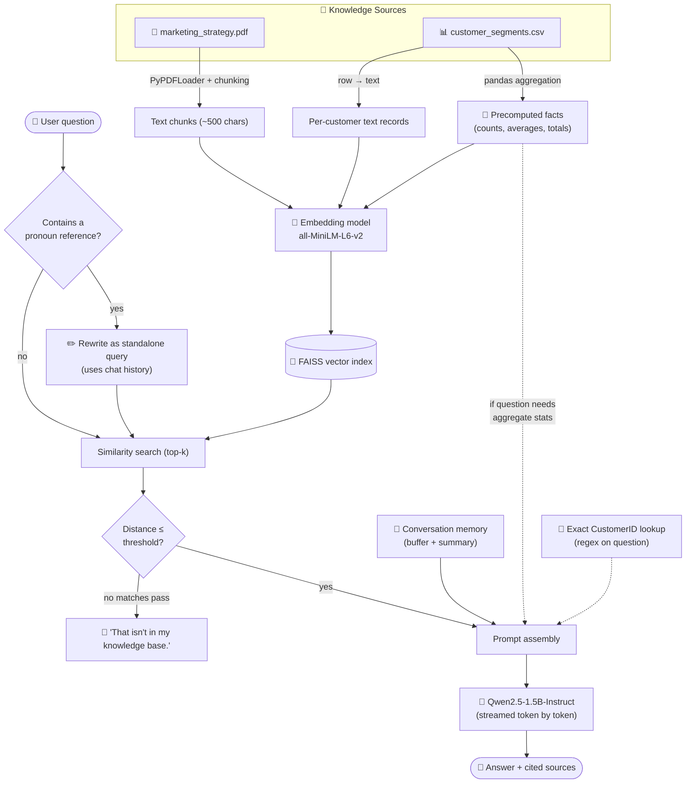
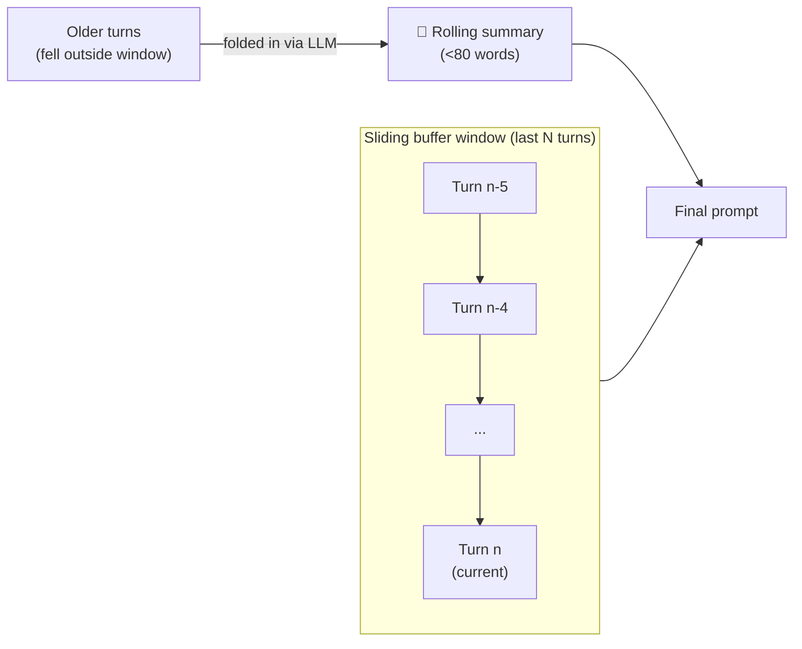
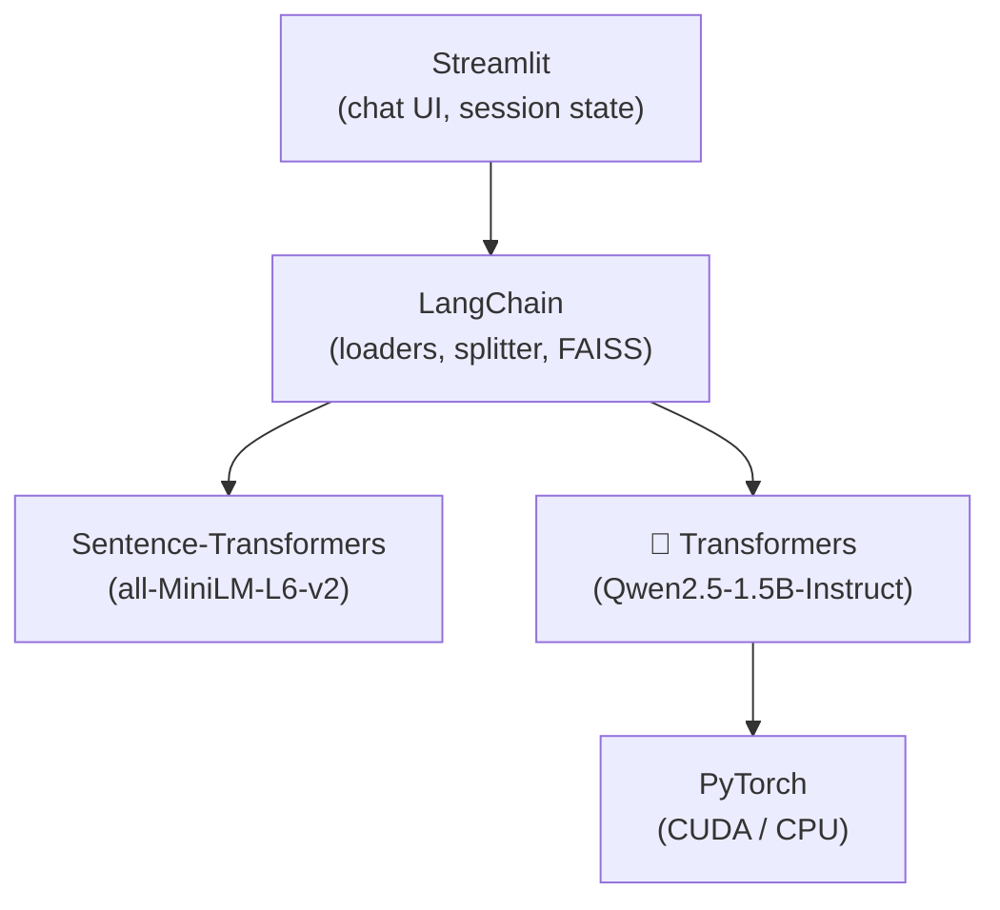
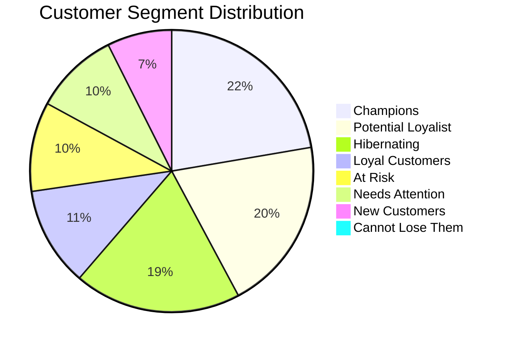

# 💬 Marketing Knowledge Assistant

A **local, API-key-free RAG chatbot** for marketing data science — it answers questions about customer segmentation (RFM), churn risk, and campaign strategy by combining a locally-run LLM with retrieval over a PDF strategy document and a CSV customer dataset, and it remembers the conversation as it goes.


---

## 📚 Table of Contents

- [What this is](#-what-this-is)
- [How it works](#-how-it-works)
- [Memory architecture](#-memory-architecture)
- [Anti-hallucination design](#-anti-hallucination-design)
- [Screenshots](#-screenshots)
- [Project structure](#-project-structure)
- [Tech stack](#-tech-stack)
- [Setup — local](#-setup--local)
- [Setup — Google Colab (GPU)](#-setup--google-colab-gpu)
- [Data](#-data)
- [Example questions](#-example-questions)
- [Configuration reference](#-configuration-reference)
- [Limitations](#-limitations)
- [License](#-license)

---

## 🧭 What this is

This project was built for a mid-term "AI Knowledge Assistant with Memory" assignment, applied to a **marketing data science** use case: a chatbot that a marketing team could actually use to ask about customer segments, churn risk, and retention strategy — grounded in real computed data, not guesses.

| Requirement | Implementation |
|---|---|
| Data integration (PDF + structured data) | `PyPDFLoader` for the strategy PDF, pandas + row-to-text conversion for the CSV |
| Embedding & indexing | `sentence-transformers/all-MiniLM-L6-v2` embeddings, indexed in **FAISS** |
| RAG pipeline | Custom retriever → prompt assembly → local LLM generation, with live token streaming |
| Conversational memory | Bounded buffer (recent turns, verbatim) + LLM-generated rolling summary of older turns |
| Follow-up handling | Automatic query rewriting so "what segment are *they* in?" resolves correctly |
| Testing & evaluation | Per-answer source citations with similarity scores, visible in the UI |

---

## ⚙️ How it works



**The short version:** retrieval finds relevant text, computed facts stop the model from guessing numbers, an exact-ID lookup handles specific customers precisely, and everything gets stitched into one prompt the local LLM turns into an answer — streamed live into the chat.

---

## 🧠 Memory architecture

Two memory mechanisms work together, matching the assignment's "buffer memory + optional summary memory" spec:



- **Buffer memory** — the most recent conversation turns are injected **verbatim** into the prompt (default: last 6 turns). This is the literal "remember what was just said" mechanism.
- **Rolling summary memory** — once turns fall outside that window, they're compressed by the LLM into a short running summary instead of being discarded, so long conversations don't lose all earlier context.
- **Query condensing** — before retrieval runs, a lightweight rewrite step turns a follow-up like *"what should we do about them?"* into a standalone query like *"what should we do about customer 12346?"*, using the buffer to resolve the reference. This only fires when the question contains a pronoun, to avoid unnecessary extra generation calls.

---

## 🛡️ Anti-hallucination design

Small local LLMs will confidently guess wrong numbers if retrieval only surfaces a handful of the 4,338 customer rows. Four layers address this directly:

| Layer | Problem it solves |
|---|---|
| **Precomputed dataset facts** | Counts, averages, and totals are calculated with pandas *before* generation — the model is told the real numbers instead of estimating from a few retrieved rows |
| **Exact CustomerID lookup** | A regex pulls the exact database row for any customer ID mentioned, bypassing similarity search entirely for that customer's facts |
| **Similarity distance threshold** | Retrieved chunks that are too dissimilar to the question are dropped; if nothing passes, the system refuses rather than answering from irrelevant context |
| **Strict system prompt** | Explicitly instructs the model to answer only from provided context and to say *"That isn't in my knowledge base"* rather than guess |

```

---

## 🗂️ Project structure

```
marketing-knowledge-assistant/
├── app.py                    # Full Streamlit application
├── marketing_strategy.pdf    # Retention & campaign strategy playbook
├── customer_segments.csv     # RFM-segmented customer data (from UCI Online Retail)
├── requirements.txt          # Python dependencies
├── .gitignore
└── README.md
```

---

## 🧰 Tech stack



| Component | Library | Role |
|---|---|---|
| UI & session state | `streamlit` | Chat interface, file upload, sidebar controls |
| Document loading | `langchain-community` | PDF parsing |
| Text splitting | `langchain-text-splitters` | Chunking long documents |
| Vector store | `faiss-cpu` | Fast similarity search |
| Embeddings | `sentence-transformers` via `langchain-huggingface` | Turning text into vectors |
| LLM inference | `transformers` + `torch` | Running the local language model |
| Data handling | `pandas` | CSV loading, RFM/aggregate computation |

---

## 💻 Setup — Local

```bash
git clone https://github.com/Worof/marketing-knowledge-assistant.git
cd marketing-knowledge-assistant
pip install -r requirements.txt
streamlit run app.py
```

Open the URL Streamlit prints (usually `http://localhost:8501`), click **🔨 Build / Rebuild Knowledge Base** in the sidebar, then start chatting.

> **GPU recommended.** On CPU-only machines, generation will be noticeably slower — consider lowering the "Max answer length" slider in the sidebar.

---

## ☁️ Setup — Google Colab (GPU)

```python
# 1. Install dependencies
!pip install -q -r requirements.txt pyngrok

# 2. Upload app.py, marketing_strategy.pdf, customer_segments.csv to /content/

# 3. Launch Streamlit in the background
import subprocess, time
proc = subprocess.Popen(["streamlit", "run", "app.py", "--server.port", "8501", "--server.headless", "true"])
time.sleep(15)

# 4. Tunnel it publicly
from pyngrok import ngrok
ngrok.set_auth_token("YOUR_NGROK_AUTHTOKEN")
print(ngrok.connect(8501))
```

Get a free ngrok token at [dashboard.ngrok.com](https://dashboard.ngrok.com/get-started/your-authtoken).

> **Runtime → Change runtime type → T4 GPU** is strongly recommended before running — CPU inference for a 1.5B model in Colab is very slow.

---

## 📊 Data

- **`customer_segments.csv`** — RFM (Recency, Frequency, Monetary) segmentation computed directly from the real [UCI Online Retail dataset](https://archive.ics.uci.edu/dataset/352/online+retail) (541,909 transactions, Dec 2010–Dec 2011). Cleaned to 4,338 unique customers, scored into quintiles, and labeled into 8 segments (Champions, At Risk, Hibernating, etc.) with a computed churn-risk rating.
- **`marketing_strategy.pdf`** — a 3-page retention and campaign playbook covering segmentation methodology, per-segment strategy, a churn-risk escalation table, and quarterly campaign priorities, grounded in the exact segment counts from the CSV above.



---

## 💬 Example questions

**Factual lookups**
```
How many customers are in the Champions segment?
What's customer 12347's segment and churn risk?
Which segment has the highest average monetary value?
```

**Strategy questions**
```
What should we do for At Risk customers?
Why shouldn't we discount the Champions segment?
What are the Q1 campaign priorities?
```

**Memory test (run in order)**
```
1. Tell me about customer 12346.
2. What segment are they in?
3. Based on the strategy, what should we do about them?
```

**Should refuse gracefully**
```
What's customer 00000000's purchase history?
What was our total revenue in 2026?
```

---

## 🔧 Configuration reference

All adjustable live from the sidebar — no code changes needed:

| Control | Default | Effect |
|---|---|---|
| Chunks retrieved per question (`k`) | 3 | More = broader context, slower & noisier; fewer = tighter, faster |
| Filter weak matches | On | Drops low-similarity retrieved chunks to reduce hallucination |
| Buffer window | 6 turns | How much recent conversation is injected verbatim |
| Summarise older turns | On | Compresses turns that fall outside the buffer window |
| Rewrite follow-up questions | On | Resolves pronouns before retrieval |
| Max answer length | 160 tokens | Shorter = faster responses |
| Cache repeated questions | On | Instant replay for repeated first-questions in a fresh session |

---

## ⚠️ Limitations

- Small local models (1.5B params) are noticeably weaker than hosted frontier models — expect occasional awkward phrasing even when the facts are correct.
- The buffer memory window is bounded; anything discussed more than ~6 turns ago is only available via the compressed summary, not verbatim.
- CPU-only inference is slow; a GPU (even a free-tier Colab T4) is recommended for a responsive demo.
- The strategy PDF is original written content for this project, not a scraped external source.

---

## 📄 License

MIT — free to use, modify, and build on.
